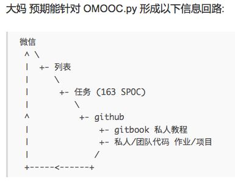

# 首次Q&A整理

####画马
程序是一门手艺活，像古筝、昆曲一样必须拳不离手曲不离口，只有练起来才能掌握其中的技巧。所谓的大牛教程一看就会是不现实的。

####女版爱因斯坦
记录自然生产、哺育过程，使文明开始尝试如何生孩子不死母亲---牛逼的创新源于一种对问题详细描述的过程。

###班级图景
----------------
教练和学员的关系 。技巧不理解或者不亲身尝试也是白搭。
如果不和学员、导师交流，一切都只是虚幻的想象。

####信息流程图

###关于提问
-----------------

不敢问？荒谬！

问问题的正确姿势就是**去问**
提问是一种极其自然的信息交流方式。很多人不提问而是抱怨没人指导。别人教程写的再好也跟你没一毛钱关系。 

why？1.教是最好的学  2.教程是基于他的经验产生的， 是作者认为的最自然的学习方式，他的想象并不一定吻合我们自己的状况。 

无论用何种教程去练习，在大量练习之后形成的语感、知识结构都是私人的。经验是你一行一行的代码写出来的。  

**问题不分小白和艰深 只有好问题和坏问题**
why？因为大家都从小白过来的。但是你小白状态时问的问题和提问的角度决定了你未来的发展。

**好问题** 能让高手产生兴趣的问题 
**坏问题**表现出来你对这个问题不认真 不论你的语气态度是多么的恭顺

（提问的艺术  **收获**）

**好问题应该具备的要素：**

* 你对问题的认真程度决定了对方的回答
如果你真的对此认真 想解决问题 表现出你的诚意
对问题的理解
* 怎么尝试？查过哪些资料？有了哪些解决途径？
* 你认为这个问题有几个关键点、可能的误解？对此你是怎么思考的？
* 观点的罗列

[珠的自白:34 如何提问?才对世界有帮助! ]( http://blog.zhgdg.org/2014-10/dm34-how2ask/)

标准答案的苦处

不把问题暴露出来，导师无法帮助你。课程设计基于一个工具链，帮助大家快速暴露弱点，导师才能帮你解决问题。
####邮件列表
--------------------------

**强调邮件列表的原因：**

* 实时交流   pull方式 只有刷屏才能看到消息 没有信息线索 只有时间线 心智负担呈指数上升

  邮件列表 提出问题只能等待 如果 问题有价值 相关人员会认真的。。。毫无干扰的回复你 

* **优雅的异步交流**  别人回答的时候 你无法补充信息 所以提问的时候必须完备 、认真 否则对方可以不care你 

* 公共邮箱 的角色 已经是历史 无法更改  意味着信用在起作用
实时交流 低价值 不负责任 不会永久性保存

* 是一整套世界观 引发配合工具、思考工具 变化
  知识螺旋：知识在信息回路中转的越多越快、创新越多。
编程、、学习的过程是一种 知识结构 破坏性的再建 思维混乱  将过程结合可执行的案例、代码。 

尽可能搭建顺畅基础工具和环境

负基础python入门教程  本地git快速发布

通过github或gitbook发布出来会形成全球唯一的URL  这些链接就是任务的结果

**岩钉**

目标 根据信息回路 搭建 
接到任务要有回声 48小时内形成URL  
disqus插件  导师就近评论 

27号之前完成阶段作业

 本人的成长速度 对他人的贡献点 自己成长的快慢 团队发展  岩钉 可判定 

每天至少一小时 80%心流时间 

每天去完成任务要么会得到结果，要么会收到问题。

###4+1
需要掌握的四项新技能：
git
github
gitbook
本地python 环境

一种交流方式：邮件列表

为什么菜鸟永远是菜鸟？
**有助于菜鸟学习的永远不是清单 而是科学地探索解决问题方法的思路。**

[为什么我总是菜鸟？](http://xiaolai.github.io/alpha/on-learning/#section-22)

如果你认为所写的教程 可以说服六个月前的自己用起来当前工具或技巧 并且会用 

 

####写教程####
对于自己写的东西 人的想象力更为丰富

隐藏任务：建立术语表

只要你觉得讨论就应该去讨论，千万不要以别人的价值观去决定自己的学习过程。

###仁波切补充

>* **清单意识** 自己维护一个最小的清单 超级帮助记忆
比如 第一周总结 学会的知识点清单 搭建环境的清单 提问清单 

>* **走弯路很有必要** 手把手教你就跳过弯路了。 

>* **多写** 写学习心得其实在逼你复盘，这是快速学习好技巧

>  你的大脑会欺骗你已掌握 但写笔记时 就发现 其实还是不懂

>* **社群** 大社群是github 小社群是python 再小社群是各分队

>  你对社群贡献越多 就得到更多  同时善用社群解决问题

 隐藏任务：安装nodejs 利用gitbook命令提示符生成pdf kindle与本地html5

  *共花费5个番茄时间*