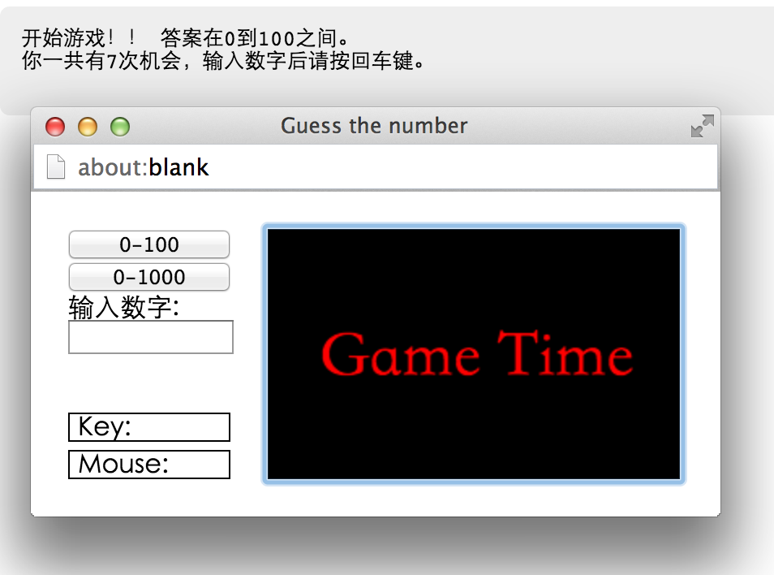

###Guess the number 

[CodeSkulptor链接](http://www.codeskulptor.org/#user39_oI2lJMYiBW_7.py)



```
# This is "Guess the number" 

import random
import simplegui

# range0-100,0-1000

def range100():
    global the_number, times,range
    the_number = random.randrange(0, 100)
    times = 7
    range=0
    print("开始游戏！！ 答案在0到100之间。\n你一共有" + str(times) + "次机会，输入数字后请按回车键。\n") 
    
def range1000():
    global the_number, times,range 
    the_number = random.randrange(0, 1000)
    times = 10  
    range=1
    print("开始游戏！！ 挑战区间1-1000。\n你一共有" + str(times) + "次机会。\n")
 
        
# main body 
def new_game(player_guess):
    global the_number, times
    times =times-1
    if  range==0  and (int(player_guess)<0 or int(player_guess)>100):
          print("错啦！请输入所选区间内整数（0-100）\n")
    elif range==1 and (int(player_guess)<0 or int(player_guess)>1000):
        print("错啦！请输入所选区间内整数（0-1000）\n")
    else:
        print("\n答案是"+ str(player_guess) +"吗？？\n")
        if int(player_guess) == the_number or times!= 0 :
            if int(player_guess) == the_number:
                print("答对啦！！！！！快找小麦拿奖品吧~\n ")   
                if range == 0:
                     range100()
                elif range == 1:
                     range1000() 
            elif int(player_guess) < the_number:
                print("低了！\n还剩" + str(times) + "次机会.\n")
            elif int(player_guess) > the_number:
                print("高了！\n还剩" + str(times) + "次机会.\n")
        else:
            print("没有机会啦！\n答案是" + str(the_number) + "。\n再玩一次吧~\n")
            if range == 0:
                     range100()
            elif range == 1:
                     range1000() 
        
# create frame
message = "Game Time"
frame = simplegui.create_frame("Guess the number", 250, 150, 100)

def draw(canvas):
    canvas.draw_text(message, [30,90], 40, "Red")

# register event handlers for control elements
frame.add_button("0-100", range100, 100)
frame.add_button("0-1000", range1000, 100)
frame.add_input("输入数字:\n", new_game, 96)
frame.set_draw_handler(draw)

# start frame
frame.start()
range100()


```


####体会
要赶在deadline之前完成真的是压力山大。告诉自己要想好以后再动手，真实情况是根本想不好。。想了东边漏了西边的节奏，后来干脆在纸上画出来，发现画的不明确就在纸上抄代码。最终组装成这样。

学python要用起来而不是单纯靠看书刷coursera。一个代码看十遍一百遍它还是那个代码。只有试了以后才会知道那一串字符是啥意思。感叹一句，哦！原来是这货呀！

不要害怕试错。


